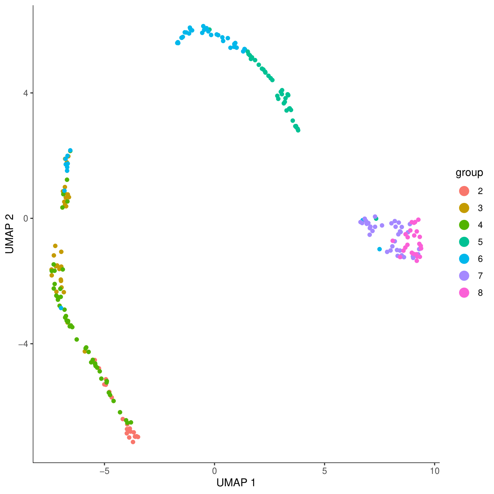
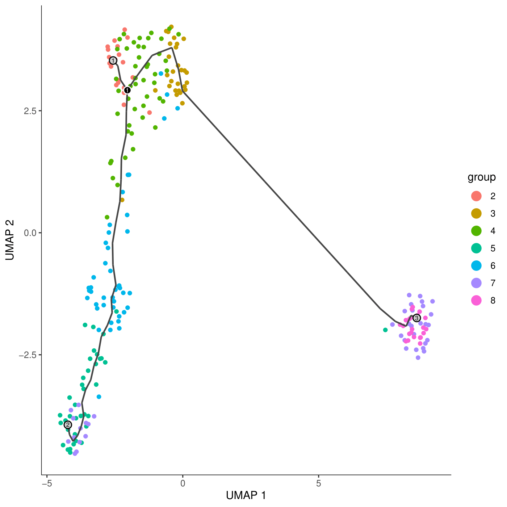
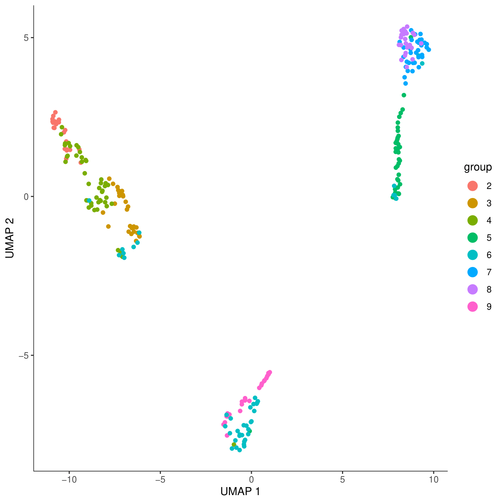
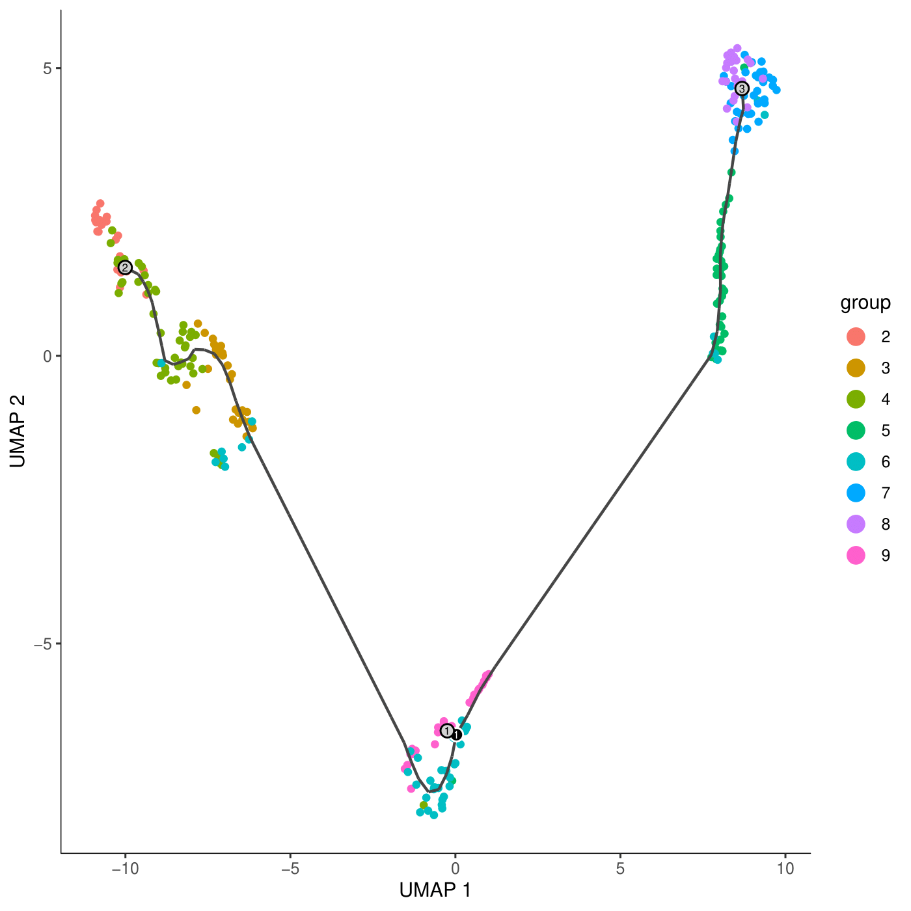

# SCRNAseq on mosquito hemocytes

## These are the files that need to made
```

page(cell_metadata, method = "print")
 #################################################################################
 plate cao_cluster            cao_cell_type
cele-001-001.CATGACTCAA   001          20     Unclassified neurons-
cele-001-001.AAGACGGCCA   001           6                 Germline
cele-001-001.GCCAACGCCA   001          13 Intestinal/rectal muscle
cele-001-001.ATAGGAGTAC   001          27        Vulval precursors
cele-001-001.CTCGTCTAGG   001           2             Coelomocytes
cele-001-001.AAGTTGCCAT   001           6                 Germline
cele-001-001.GTTGAAGGAT   001           9                     <NA>
cele-001-001.AACTACGGCT   001          19 Ciliated sensory neurons
cele-001-001.CATTCTAGAA   001          10                Failed QC
cele-001-001.AATACTCTTC   001           7               Seam cells
cele-001-001.GAGGCTTATT   001          19 Ciliated sensory neurons
cele-001-001.ATGCCGGACG   001          25      Non-seam hypodermis
cele-001-001.AGCGGTAACG   001          11     Pharyngeal epithelia
###################################################################################

#this ignores the header, so yes a header with nothing in col1,
 page(expression_matrix, method = "print")
###################################################################################
20271 x 42035 sparse Matrix of class "dgCMatrix"

WBGene00000001 .  .  . .  .  . .  . .  . . .  . . . .  . .  .  .  .  .  .  .  .  .  .  .  .  .
WBGene00000002 .  .  . .  .  . .  . .  . . .  . . . .  . .  .  .  .  .  .  .  .  .  .  .  .  .
WBGene00000003 .  .  . .  .  . .  . .  . . .  . . . .  . .  .  .  .  .  .  .  .  .  .  .  2  .
WBGene00000004 .  .  . .  .  . .  . .  . . .  . . . .  . .  .  .  .  .  .  .  .  .  .  .  .  .
WBGene00000005 .  .  . .  .  . .  . .  . . .  . . . .  . .  .  .  .  .  .  .  .  .  .  .  .  .
###################################################################################

 page(gene_annotation, method = "print")
###################################################################################
gene_short_name
WBGene00000001           aap-1
WBGene00000002           aat-1
WBGene00000003           aat-2
WBGene00000004           aat-3
WBGene00000005           aat-4
############################################################################

> dim(cell_metadata)
[1] 42035     4
> dim(expression_matrix)
[1] 20271 42035
> dim(gene_annotation)
[1] 20271     1
```


### Create data tables for smith smith+severo analysis
```
#/work/gif/remkv6/Smith_Ryan/01_Monocle
#transposed Severo and Smith datasets in excel to obtain these files
SeveroHemocyteRNA.txt
SmithHemocyteRNA.txt
SmithHemocyteRNATransposePower2.txt #transposed, and inversed the log2 normalization
SeveroHemocyteRNAOrig.txt

cat <(awk 'NR>4{print $1}' SmithHemocyteRNATransposePower2.txt) <(awk 'NR>3{print $1}' SeveroHemocyteRNAOrig.txt) >AllGenesSmithSevero.txt

#concatenate datasets, add missing genes to each dataset to create expression matrices
awk 'NR>3' SeveroHemocyteRNAOrig.txt |cut -f -26 |cat - <(awk 'NR>5{print $1,"0","0","0","0","0","0","0","0","0","0","0","0","0","0","0","0","0","0","0","0","0","0","0","0","0"} ' SmithHemocyteRNATransposePower2.txt |tr " " "\t" ) <(awk  '{print $1,"0","0","0","0","0","0","0","0","0","0","0","0","0","0","0","0","0","0","0","0","0","0","0","0","0"}' AllGenesSmithSevero.txt |tr " " "\t")|sort -u -k 1,1 >SeveroAllGenes.txt


awk 'NR>4' SmithHemocyteRNATransposePower2.txt |cat - <(awk 'NR>3{print $1,"0","0","0","0","0","0","0","0","0","0","0","0","0","0","0","0","0","0","0","0","0","0","0","0","0","0","0","0","0","0","0","0","0","0","0","0","0","0","0","0","0","0","0","0","0","0","0","0","0","0","0","0","0","0","0","0","0","0","0","0","0","0","0","0","0","0","0","0","0","0","0","0","0","0","0","0","0","0","0","0","0","0","0","0","0","0","0","0","0","0","0","0","0","0","0","0","0","0","0","0","0","0","0","0","0","0","0","0","0","0","0","0","0","0","0","0","0","0","0","0","0","0","0","0","0","0","0","0","0","0","0","0","0","0","0","0","0","0","0","0","0","0","0","0","0","0","0","0","0","0","0","0","0","0","0","0","0","0","0","0","0","0","0","0","0","0","0","0","0","0","0","0","0","0","0","0","0","0","0","0","0","0","0","0","0","0","0","0","0","0","0","0","0","0","0","0","0","0","0","0","0","0","0","0","0","0","0","0","0","0","0","0","0","0","0","0","0","0","0","0","0","0","0","0","0","0","0","0","0","0","0","0","0","0","0","0","0","0","0"} ' SeveroHemocyteRNAOrig.txt |tr " " "\t" ) <(awk  '{print $1,"0","0","0","0","0","0","0","0","0","0","0","0","0","0","0","0","0","0","0","0","0","0","0","0","0","0","0","0","0","0","0","0","0","0","0","0","0","0","0","0","0","0","0","0","0","0","0","0","0","0","0","0","0","0","0","0","0","0","0","0","0","0","0","0","0","0","0","0","0","0","0","0","0","0","0","0","0","0","0","0","0","0","0","0","0","0","0","0","0","0","0","0","0","0","0","0","0","0","0","0","0","0","0","0","0","0","0","0","0","0","0","0","0","0","0","0","0","0","0","0","0","0","0","0","0","0","0","0","0","0","0","0","0","0","0","0","0","0","0","0","0","0","0","0","0","0","0","0","0","0","0","0","0","0","0","0","0","0","0","0","0","0","0","0","0","0","0","0","0","0","0","0","0","0","0","0","0","0","0","0","0","0","0","0","0","0","0","0","0","0","0","0","0","0","0","0","0","0","0","0","0","0","0","0","0","0","0","0","0","0","0","0","0","0","0","0","0","0","0","0","0","0","0","0","0","0","0","0","0","0","0","0","0","0","0","0","0","0","0"}' AllGenesSmithSevero.txt |tr " " "\t") |sort -u -k 1,1 >SmithAllGenes.txt


paste SeveroAllGenes.txt SmithAllGenes.txt |cut -f 1-26,28- |head -n -1 >tailer.txt
paste  <(awk 'NR==4' SeveroHemocyteRNAOrig.txt|cut -f -26 |sed 's/Gene IDs//g' ) <(awk 'NR==1' SmithHemocyteRNATransposePower2.txt |cut -f 2-)   >header.txt
cat header.txt tailer.txt >AllGenesSmithSeveroFormat.txt

#remove the gene id from header
vi AllGenesSmithSeveroFormat.txt


cat <(awk 'NR==1' SmithHemocyteRNATransposePower2.txt |cut -f 2- ) SmithAllGenes.txt |head -n -1>SmithExpressionMatrix
vi SmithExpressionMatrix add the tab
cat <(awk 'NR==4' SeveroHemocyteRNAOrig.txt|cut -f -26) SeveroAllGenes.txt >SeveroExpressionMatrix

#cannot have floating point numbers, so round.  Rounding eventually done in R
#####awk '{for (i=1; i<=NF; i++) printf "%0.f %s", $i, (i==NF?RS:FS)}' SmithExpressionMatrix |cut -f 2- |paste <(awk '{print $1}' SmithExpressionMatrix) - |cat <(awk 'NR==1' SmithExpressionMatrix) - | awk 'NR>1{for (i=1; i<=NF; i++) printf "%0.f %s", $i, (i==NF?RS:FS)}' SmithExpressionMatrix |cut -f 2- |paste <(awk 'NR>1{print $1}' SmithExpressionMatrix) - |cat <(awk 'NR==1' SmithExpressionMatrix) - >SmithExpressionMatrix2


#Get gene annotations Create gene to annotation mapping from gff
wget ftp://ftp.ensemblgenomes.org/pub/release-46/metazoa/gff3/anopheles_gambiae/Anopheles_gambiae.AgamP4.46.gff3.gz
less -S Anopheles_gambiae.AgamP4.46.gff3 |awk -F"\t" '$3=="gene"{print $9}' |sed 's/ID=gene://g' |sed 's/;/\t/1' >gene_annotations


#cell metadata
vi cell_metadata #copied from excel
cat  <(awk 'NR==1' SmithOrigCellMetadata) <(awk 'NR==4' SeveroHemocyteRNAOrig.txt|cut -f -26  |tr "\t" "\n" |awk '{print $1,"naive","G9","9"}' |tr " " "\t") <(awk 'NR>1' SmithOrigCellMetadata) >Cell_metadata_Combine
#deleted modify gene line vi Cell_metadata_Combine

#create gene metadata, since they are not known
less AllGenesSmithSeveroFormat.txt |cut -f 1|awk 'NR>1' |awk '{print $1"\tG"substr($1,6,length($1))}' >AllGeneMetadata
```


### Smith data only plot
```
install.packages("uwot")
library(monocle3)
library(dplyr)
library(Matrix)
expression_matrix2<- round(as.matrix(read.table("SmithExpressionMatrix",header = T)))
gene_metadata2 <- as.matrix(read.table("AllGeneMetadata",header = T,row.names = 1))
cell_metadata2<- as.matrix(read.table("SmithOrigCellMetadata",header = T,row.names = 1))

M1 <- as(expression_matrix2, "dgCMatrix")
cds <- new_cell_data_set(M1,cell_metadata = cell_metadata2,gene_metadata = gene_metadata2)

cds <- preprocess_cds(cds, num_dim = 10)
cds <- reduce_dimension(cds,reduction_method=c("UMAP"))
plot_cells(cds, reduction_method="UMAP", color_cells_by="group",cell_size=1.3,label_leaves=TRUE,label_cell_groups=FALSE,graph_label_size=2)
```


### Smith data pseudotime
```
library(monocle3)
library(dplyr)
expression_matrix2<- round(as.matrix(read.table("SmithExpressionMatrix",header = T)))
gene_metadata2 <- as.matrix(read.table("AllGeneMetadata",header = T,row.names = 1))
cell_metadata2<- as.matrix(read.table("SmithOrigCellMetadata",header = T,row.names = 1))
library(Matrix)
M1 <- as(expression_matrix2, "dgCMatrix")
cds <- new_cell_data_set(M1,cell_metadata = cell_metadata2,gene_metadata = gene_metadata2)

cds <- preprocess_cds(cds, num_dim = 100)
cds <- reduce_dimension(cds,reduction_method=c("UMAP"))
cds <- cluster_cells(cds)
cds <- learn_graph(cds)
cds <- order_cells(cds)
plot_cells(cds, reduction_method="UMAP", color_cells_by="group",cell_size=1.3,label_cell_groups=FALSE,label_leaves=TRUE,graph_label_size=2,label_branch_points=TRUE)
```



### Smith + severo cell plot
```
#create appropriate files

### Working model from Smith only data
library(monocle3)
library(dplyr)
library(Matrix)
expression_matrix2<- round(as.matrix(read.table("AllGenesSmithSeveroFormat.txt",header = T,row.names=1)))
gene_metadata2 <- as.matrix(read.table("AllGeneMetadata",header = T,row.names = 1))
cell_metadata2<- as.matrix(read.table("Cell_metadata_Combine",header = T,row.names = 1))

M1 <- as(expression_matrix2, "dgCMatrix")
cds <- new_cell_data_set(M1,cell_metadata = cell_metadata2,gene_metadata = gene_metadata2)

cds <- preprocess_cds(cds, num_dim = 50)
cds <- reduce_dimension(cds,reduction_method=c("UMAP"))
cds <- cluster_cells(cds)
plot_cells(cds, reduction_method="UMAP", color_cells_by="group",cell_size=1.3,label_leaves=TRUE,label_cell_groups=FALSE,graph_label_size=2)
```




### Smith +severo pseudotime
```
library(monocle3)
library(dplyr)
library(Matrix)
expression_matrix2<- round(as.matrix(read.table("AllGenesSmithSeveroFormat.txt",header = T,row.names=1)))
gene_metadata2 <- as.matrix(read.table("AllGeneMetadata",header = T,row.names = 1))
cell_metadata2<- as.matrix(read.table("Cell_metadata_Combine",header = T,row.names = 1))

M1 <- as(expression_matrix2, "dgCMatrix")
cds <- new_cell_data_set(M1,cell_metadata = cell_metadata2,gene_metadata = gene_metadata2)

cds <- preprocess_cds(cds, num_dim = 50)
cds <- reduce_dimension(cds,reduction_method=c("UMAP"))
cds <- cluster_cells(cds)
cds <- learn_graph(cds)
cds <- order_cells(cds)
plot_cells(cds, reduction_method="UMAP", color_cells_by="group",cell_size=1.3,label_cell_groups=FALSE,label_leaves=TRUE,graph_label_size=2,label_branch_points=TRUE)
```



The Severo cells appear to group with Smith's group 6.  The pseudotime seems to indicate at least two different fates.
