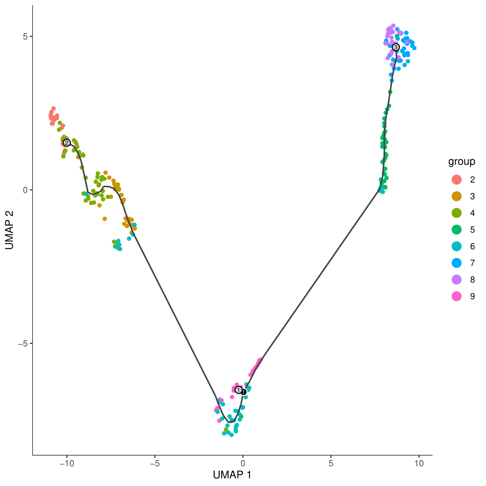
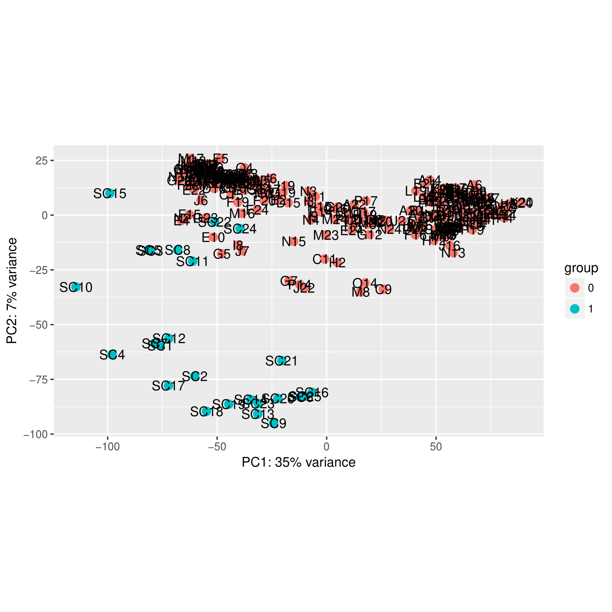
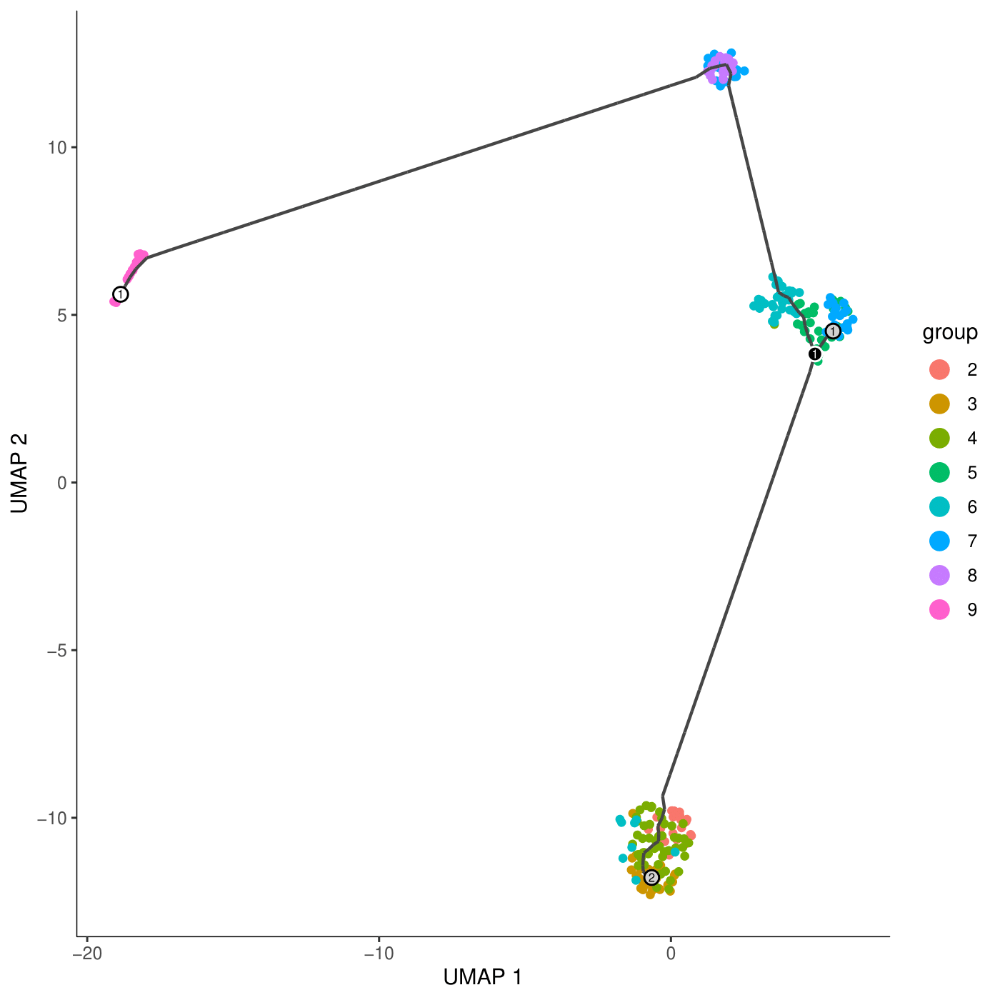
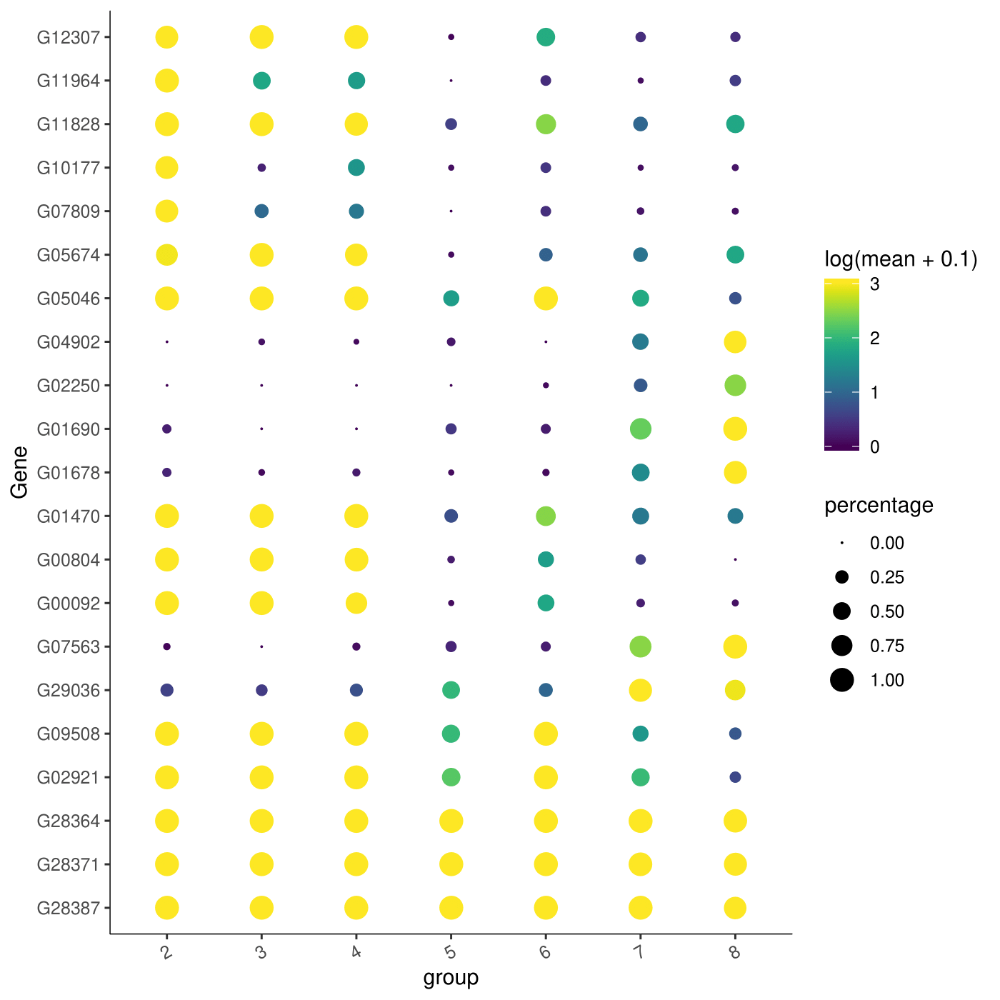
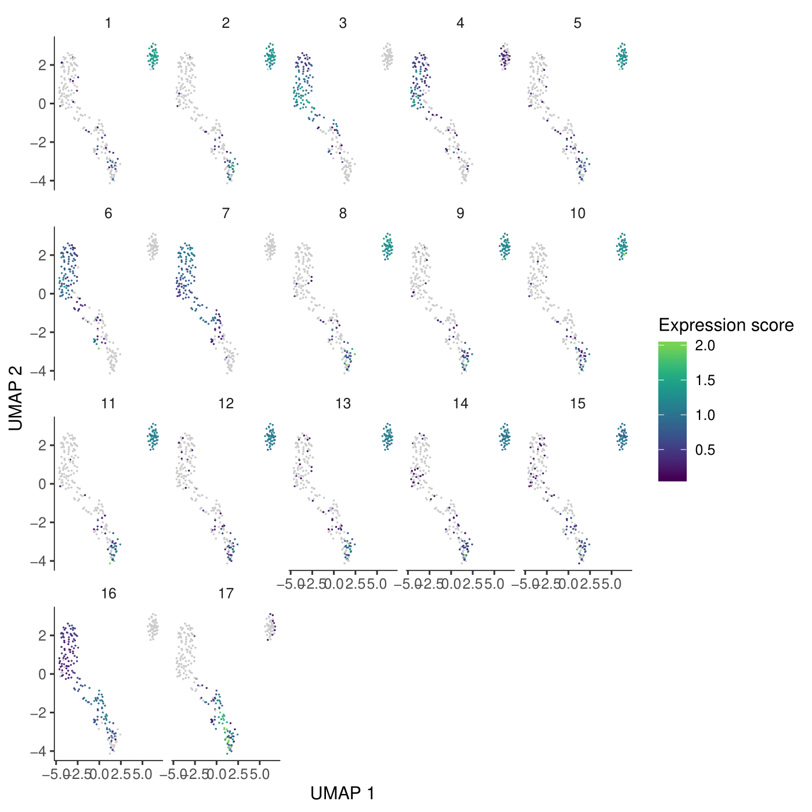
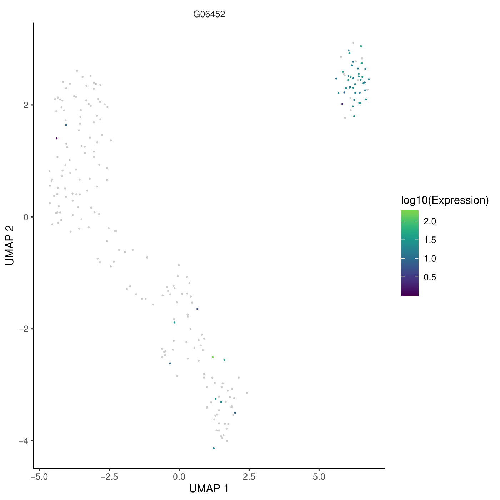
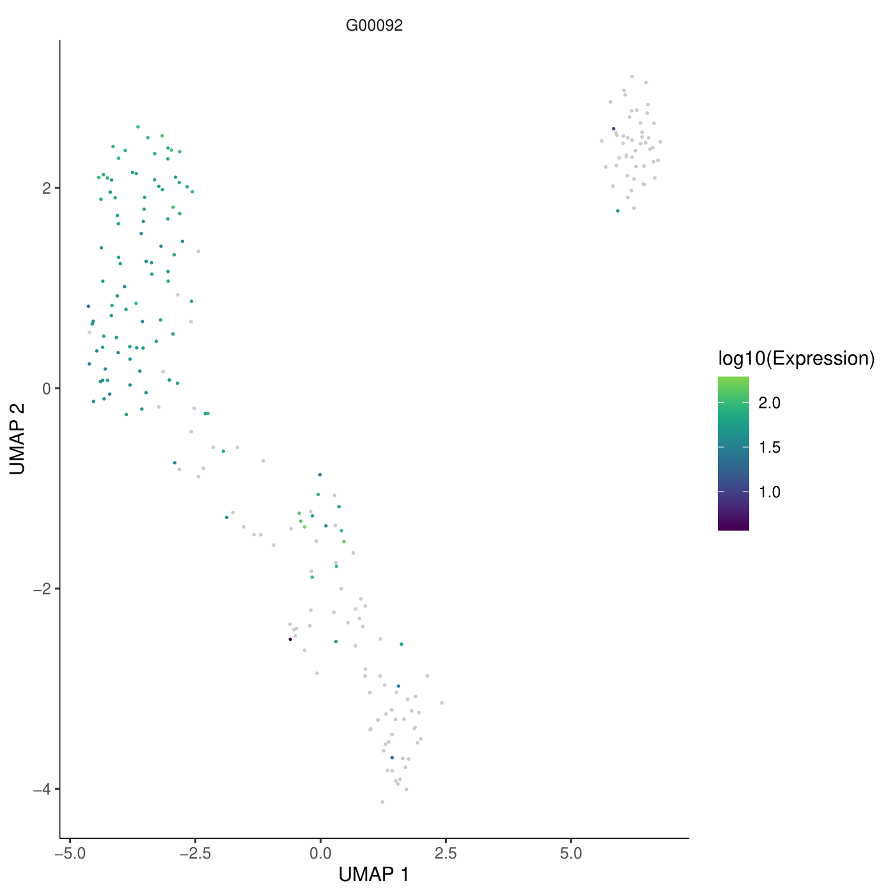
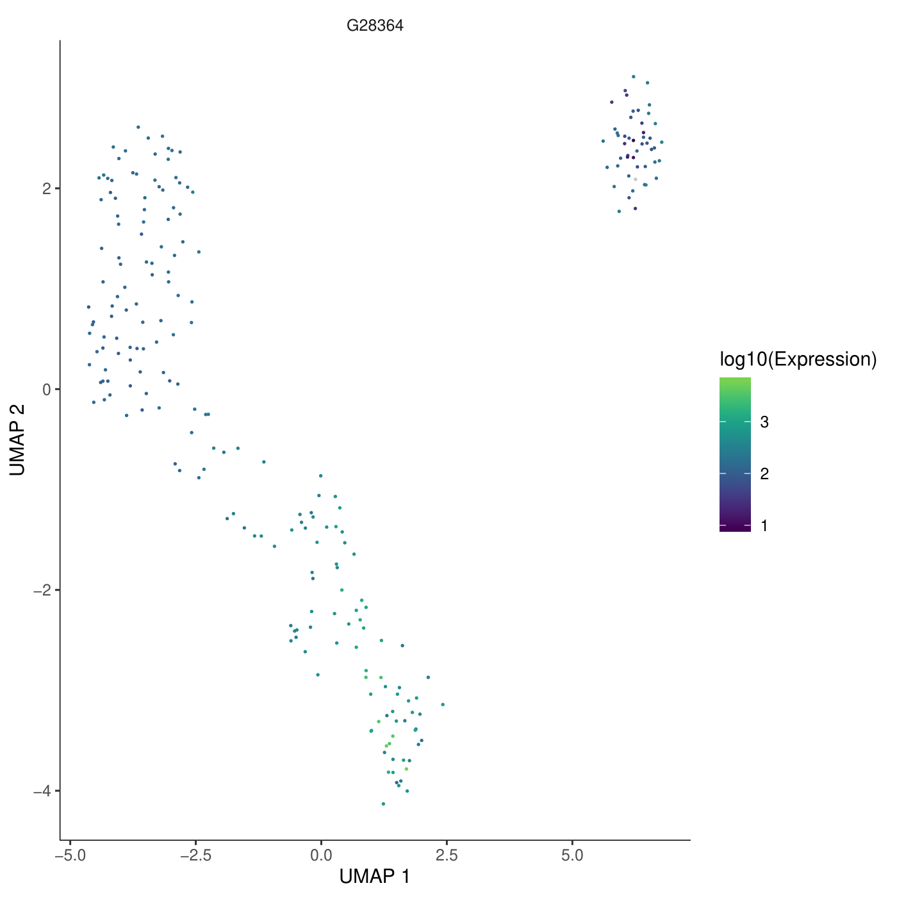
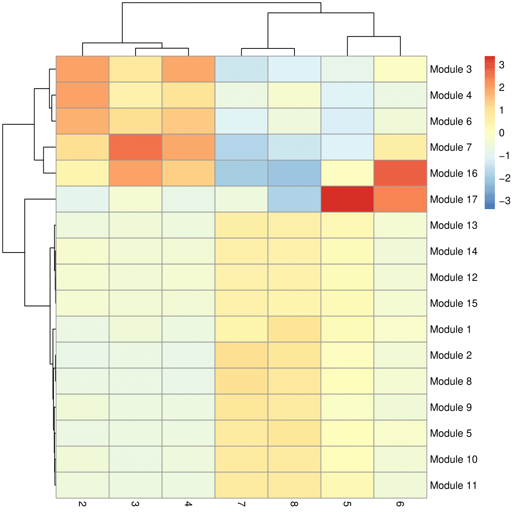

# Monocle Dissection
```
1.  Use lineage 5 as root for just the smith data.
2.  Remove all non-common genes and see how smith/severo cluster –expect those to be dispersed around, not clustering to a single spot.
3.  Do severo data by themselves
4.  Find genes with expression that define the populations.
```


### Smith data pseudotime -- Rooted to cluster 5
```
library(monocle3)
library(dplyr)
expression_matrix2<- round(as.matrix(read.table("SmithExpressionMatrix",header = T)))
gene_metadata2 <- as.matrix(read.table("AllGeneMetadata",header = T,row.names = 1))
cell_metadata2<- as.matrix(read.table("SmithOrigCellMetadata",header = T,row.names = 1))
library(Matrix)
M1 <- as(expression_matrix2, "dgCMatrix")
cds <- new_cell_data_set(M1,cell_metadata = cell_metadata2,gene_metadata = gene_metadata2)

cds <- preprocess_cds(cds, num_dim = 100)
cds <- reduce_dimension(cds,reduction_method=c("UMAP"))
cds <- cluster_cells(cds)
cds <- learn_graph(cds)
cds <- order_cells(cds,root_cells=row.names(colData(cds[,3],on=5)))
plot_cells(cds, reduction_method="UMAP", color_cells_by="group",cell_size=1.3,label_cell_groups=FALSE,label_leaves=TRUE,graph_label_size=2,label_branch_points=TRUE)
```


### Smith +severo pseudotime rooted on cluster 5
```
install.packages("uwot")

library(monocle3)
library(dplyr)
library(Matrix)
expression_matrix2<- round(as.matrix(read.table("AllGenesSmithSeveroFormat.txt",header = T,row.names=1)))
gene_metadata2 <- as.matrix(read.table("AllGeneMetadata",header = T,row.names = 1))
cell_metadata2<- as.matrix(read.table("Cell_metadata_Combine",header = T,row.names = 1))

M1 <- as(expression_matrix2, "dgCMatrix")
cds <- new_cell_data_set(M1,cell_metadata = cell_metadata2,gene_metadata = gene_metadata2)

cds <- preprocess_cds(cds, num_dim = 100)
cds <- reduce_dimension(cds,reduction_method=c("UMAP"))
cds <- cluster_cells(cds)
cds <- learn_graph(cds)
cds <- order_cells(cds,root_cells=row.names(colData(cds[,3],on=5)))

plot_cells(cds, reduction_method="UMAP", color_cells_by="group",cell_size=1.3,label_cell_groups=FALSE,label_leaves=TRUE,graph_label_size=2,label_branch_points=TRUE)

```



### Smith + severo cell plot remove uncommon genes -- prep for monocle
```
#fix these to remove genes that are all zeros in either dataset  -- AllGenesSmithSeveroFormat.txt
less AllGenesSmithSeveroFormat.txt |awk '($2+$3+$4+$5+$6+$7+$8+$9+$10+$11+$12+$13+$14+$15+$16+$17+$18+$19+$20+$21+$22+$23+$24+$25+$26) >0' |awk '($27 +$28 +$29 +$30 +$31 +$32 +$33 +$34 +$35 +$36 +$37 +$38 +$39 +$40 +$41 +$42 +$43 +$44 +$45 +$46 +$47 +$48 +$49 +$50 +$51 +$52 +$53 +$54 +$55 +$56 +$57 +$58 +$59 +$60 +$61 +$62 +$63 +$64 +$65 +$66 +$67 +$68 +$69 +$70 +$71 +$72 +$73 +$74 +$75 +$76 +$77 +$78 +$79 +$80 +$81 +$82 +$83 +$84 +$85 +$86 +$87 +$88 +$89 +$90 +$91 +$92 +$93 +$94 +$95 +$96 +$97 +$98 +$99 +$100 +$101 +$102 +$103 +$104 +$105 +$106 +$107 +$108 +$109 +$110 +$111 +$112 +$113 +$114 +$115 +$116 +$117 +$118 +$119 +$120 +$121 +$122 +$123 +$124 +$125 +$126 +$127 +$128 +$129 +$130 +$131 +$132 +$133 +$134 +$135 +$136 +$137 +$138 +$139 +$140 +$141 +$142 +$143 +$144 +$145 +$146 +$147 +$148 +$149 +$150 +$151 +$152 +$153 +$154 +$155 +$156 +$157 +$158 +$159 +$160 +$161 +$162 +$163 +$164 +$165 +$166 +$167 +$168 +$169 +$170 +$171 +$172 +$173 +$174 +$175 +$176 +$177 +$178 +$179 +$180 +$181 +$182 +$183 +$184 +$185 +$186 +$187 +$188 +$189 +$190 +$191 +$192 +$193 +$194 +$195 +$196 +$197 +$198 +$199 +$200 +$201 +$202 +$203 +$204 +$205 +$206 +$207 +$208 +$209 +$210 +$211 +$212 +$213 +$214 +$215 +$216 +$217 +$218 +$219 +$220 +$221 +$222 +$223 +$224 +$225 +$226 +$227 +$228 +$229 +$230 +$231 +$232 +$233 +$234 +$235 +$236 +$237 +$238 +$239 +$240 +$241 +$242 +$243 +$244 +$245 +$246 +$247 +$248 +$249 +$250 +$251 +$252 +$253 +$254 +$255 +$256 +$257 +$258 +$259 +$260 +$261 +$262 +$263 +$264 +$265)>0' |cat <(awk 'NR==1' AllGenesSmithSeveroFormat.txt) - >ExpressedGenesSmithSeveroFormat.txt


#change gene metadata to only those gene represented above # AllGeneMetadata
 awk '{print $1}' ExpressedGenesSmithSeveroFormat.txt |grep -f - AllGeneMetadata >ExpressedGeneMetaDataSmithSevero

R
library(monocle3)
library(dplyr)
library(Matrix)
expression_matrix2<- round(as.matrix(read.table("ExpressedGenesSmithSeveroFormat.txt",header = T,row.names=1)))
gene_metadata2 <- as.matrix(read.table("ExpressedGeneMetaDataSmithSevero",header = T,row.names = 1))
cell_metadata2<- as.matrix(read.table("Cell_metadata_Combine",header = T,row.names = 1))

M1 <- as(expression_matrix2, "dgCMatrix")
cds <- new_cell_data_set(M1,cell_metadata = cell_metadata2,gene_metadata = gene_metadata2)

cds <- preprocess_cds(cds, num_dim = 100)
cds <- reduce_dimension(cds,reduction_method=c("UMAP"))
cds <- cluster_cells(cds)
plot_cells(cds, reduction_method="UMAP", color_cells_by="group",cell_size=1.3,label_leaves=TRUE,label_cell_groups=FALSE,graph_label_size=2)
```


### Smith + severo cell plot remove uncommon genes, pseudotime, rooted to group 5
```
library(monocle3)
library(dplyr)
library(Matrix)
expression_matrix2<- round(as.matrix(read.table("ExpressedGenesSmithSeveroFormat.txt",header = T,row.names=1)))
gene_metadata2 <- as.matrix(read.table("ExpressedGeneMetaDataSmithSevero",header = T,row.names = 1))
cell_metadata2<- as.matrix(read.table("Cell_metadata_Combine",header = T,row.names = 1))

M1 <- as(expression_matrix2, "dgCMatrix")
cds <- new_cell_data_set(M1,cell_metadata = cell_metadata2,gene_metadata = gene_metadata2)

cds <- preprocess_cds(cds, num_dim = 100)
cds <- reduce_dimension(cds,reduction_method=c("UMAP"))
cds <- cluster_cells(cds)
cds <- learn_graph(cds)
cds <- order_cells(cds,root_cells=row.names(colData(cds[,3],on=5)))
plot_cells(cds, reduction_method="UMAP", color_cells_by="group",cell_size=1.3,label_leaves=TRUE,label_cell_groups=FALSE,graph_label_size=2)
```


### Severo data alone
```
cut -f 1-26 AllGenesSmithSeveroFormat.txt >SeveroGenesOnly.txt
awk 'NR<27' Cell_metadata_Combine >SeveroCellMetadataOnly


library(monocle3)
library(dplyr)
library(Matrix)
expression_matrix2<- round(as.matrix(read.table("SeveroGenesOnly.txt",header = T,row.names=1)))
gene_metadata2 <- as.matrix(read.table("AllGeneMetadata",header = T,row.names = 1))
cell_metadata2<- as.matrix(read.table("SeveroCellMetadataOnly",header = T,row.names = 1))

M1 <- as(expression_matrix2, "dgCMatrix")
cds <- new_cell_data_set(M1,cell_metadata = cell_metadata2,gene_metadata = gene_metadata2)

cds <- preprocess_cds(cds, num_dim = 10)
cds <- reduce_dimension(cds,reduction_method=c("UMAP"))
cds <- cluster_cells(cds)
cds <- learn_graph(cds)
cds <- order_cells(cds)
plot_cells(cds, reduction_method="UMAP", color_cells_by="group",cell_size=1.3,label_cell_groups=FALSE,label_leaves=TRUE,graph_label_size=2,label_branch_points=TRUE)

```


## Fix normalization between samples

### Deseq normalization
```
# some genes are super high in the severo data, so need to adjust, but on average severo data has 1000's more reads
#the severo data that has high counts, does not associate with super large genes, so they appear normalized.
less -S AllGenesSmithSeveroFormat.txt |awk 'NR>1' |sort -k2,2nr  |less -S
awk '$3=="gene" {print $5-$4,$9}' Anopheles_gambiae.AgamP4.46.gff3 |sort -k1,1nr  |less


less Cell_metadata_Combine |cut -f 1,4 |awk '{if($2!=9){print $1"\t0"}else {print $1"\t1"}}' >ConditionTable.txt

cp  AllGenesSmithSeveroFormat.txt DeseqTable.txt
#modified first col of header
vi DeseqTable.txt
#add 1 to every gene count to allow for deseq log transformation
awk 'NR>1' DeseqTable.txt |cut -f 2- |awk -v n=1 -F"\t" '{for(i=1;i<=NF;i++)printf($i+n)"\t"};{print FS}'  |paste <(cut -f 1 DeseqTable.txt|awk 'NR>1') - |cat <(awk 'NR==1' DeseqTable.txt) - >DeseqTable2.txt

#using DESEQ to normalize genes
ml r-deseq2/1.20.0-py2-r3.5-openmpi3-zhebatp

R
 library("DESeq2")
 dat<-ceiling(read.table("DeseqTable2.txt",header = T,quote = "",row.names = 1))
 dat <- as.matrix(dat)
 condition <- factor(c(rep("1",25),rep("0",239)))
 condition=relevel(condition,ref = "0")
 coldata <-read.table("ConditionTable.txt",header = T,row.names = 1)
 coldata <- data.frame(row.names=colnames(dat), condition)
 dds <- DESeqDataSetFromMatrix(countData = dat, colData = coldata,design=~ condition)
 dds <- DESeq(dds)

###############################################################################
>  dat<-ceiling(read.table("DeseqTable2.txt",header = T,quote = "",row.names = 1))
>  dat <- as.matrix(dat)
>  condition <- factor(c(rep("1",25),rep("0",239)))
>  condition=relevel(condition,ref = "0")
>  coldata <-read.table("ConditionTable.txt",header = T,row.names = 1)
>  coldata <- data.frame(row.names=colnames(dat), condition)
>  dds <- DESeqDataSetFromMatrix(countData = dat, colData = coldata,design=~ condition)
converting counts to integer mode
>  dds <- DESeq(dds)
estimating size factors
estimating dispersions
gene-wise dispersion estimates
mean-dispersion relationship
-- note: fitType='parametric', but the dispersion trend was not well captured by the
   function: y = a/x + b, and a local regression fit was automatically substituted.
   specify fitType='local' or 'mean' to avoid this message next time.
final dispersion estimates
fitting model and testing
-- replacing outliers and refitting for 5446 genes
-- DESeq argument 'minReplicatesForReplace' = 7
-- original counts are preserved in counts(dds)
estimating dispersions
fitting model and testing
Warning message:
In fitDisp(ySEXP = ySEXP, xSEXP = xSEXP, mu_hatSEXP = mu_hatSEXP,  :
  '.Random.seed[1]' is not a valid integer, so ignored
#########################################################################################


 res <- results(dds)
 table(res$padj<0.05)
 res <- res[order(res$padj), ]
 resdata <- merge(as.data.frame(res), as.data.frame(counts(dds, normalized=TRUE)), by="row.names", sort=FALSE)
 names(resdata)[1] <- "Gene"
 write.csv(resdata, file="SmithSeveroNormalized",quote = FALSE,row.names = F)

 #################################################################################
 FALSE  TRUE
  2766 10666
 >  res <- res[order(res$padj), ]
 >  resdata <- merge(as.data.frame(res), as.data.frame(counts(dds, normalized=TRUE)), by="row.names", sort=FALSE)
 >  names(resdata)[1] <- "Gene"
 >  write.csv(resdata, file="SmithSeveroNormalized",quote = FALSE,row.names = F)

 >   rld <- rlogTransformation(dds)
 rlog() may take a long time with 50 or more samples,
 vst() is a much faster transformation
 ^C
  > help(vst)
 >   rld <- vst(dds)
 -- note: fitType='parametric', but the dispersion trend was not well captured by the
    function: y = a/x + b, and a local regression fit was automatically substituted.
    specify fitType='local' or 'mean' to avoid this message next time.

  rld <- vst(dds)
  library(ggplot2)
  p <- plotPCA(rld)
  p <- p + geom_text(aes_string(x = "PC1", y = "PC2", label = "name"), color = "black")
  print(p)
  q()


 mv Rplots.pdf DESEQPCA.pdf

less  -S SmithSeveroNormalized| sed 's/,/\t/g' |cut -f 1,8- |awk 'NR>1' |sort -k1,1V |cat <(awk 'NR==1' SmithSeveroNormalized| sed 's/,/\t/g' |cut -f 1,8- ) - >NormalizedSmithSeveroCounts4Monocle.tab

#fix the header to match col1 of nothing
 vi NormalizedSmithSeveroCounts4Monocle.tab
```
#FIX ME DESEQ PCA


#### Run monocle to see if this normalized dataset accomplishes the clustering
```

library(monocle3)
library(dplyr)
library(Matrix)
expression_matrix2<- round(as.matrix(read.table("NormalizedSmithSeveroCounts4Monocle.tab",header = T,row.names=1)))
gene_metadata2 <- as.matrix(read.table("AllGeneMetadata",header = T,row.names = 1))
cell_metadata2<- as.matrix(read.table("Cell_metadata_Combine",header = T,row.names = 1))

M1 <- as(expression_matrix2, "dgCMatrix")

#if this breaks, your files are wrong
cds <- new_cell_data_set(M1,cell_metadata = cell_metadata2,gene_metadata = gene_metadata2)


cds <- preprocess_cds(cds, num_dim = 100)
cds <- reduce_dimension(cds,reduction_method=c("UMAP"))
cds <- cluster_cells(cds)
cds <- learn_graph(cds)
cds <- order_cells(cds,root_cells=row.names(colData(cds[,3],on=5)))

plot_cells(cds, reduction_method="UMAP", color_cells_by="group",cell_size=1.3,label_cell_groups=FALSE,label_leaves=TRUE,graph_label_size=2,label_branch_points=TRUE)


#This places the severo samples further away from the smith samples, so normalization of both datasets made this worse.
```



### Try to use upper quartile normalization on severo deata

```
# calculated upper quartile in excel, divided all values by their upper quartile and then averaged all of the upper quartile's and multiplied all all values by the mean of all upper quartile's.
ModifiedForExcelAllGenesSmithSeveroFormatNormalized.txt


library(monocle3)
library(dplyr)
library(Matrix)
expression_matrix2<- round(as.matrix(read.table("ModifiedForExcelAllGenesSmithSeveroFormatNormalized.txt",header = T,row.names=1)))
gene_metadata2 <- as.matrix(read.table("AllGeneMetadata",header = T,row.names = 1))
cell_metadata2<- as.matrix(read.table("Cell_metadata_Combine",header = T,row.names = 1))

M1 <- as(expression_matrix2, "dgCMatrix")

#if this breaks, your files are wrong
cds <- new_cell_data_set(M1,cell_metadata = cell_metadata2,gene_metadata = gene_metadata2)

cds <- preprocess_cds(cds, num_dim = 100)
cds <- reduce_dimension(cds,reduction_method=c("UMAP"))
cds <- cluster_cells(cds)
cds <- learn_graph(cds)
cds <- order_cells(cds,root_cells=row.names(colData(cds[,3],on=5)))

plot_cells(cds, reduction_method="UMAP", color_cells_by="group",cell_size=1.3,label_cell_groups=FALSE,label_leaves=TRUE,graph_label_size=2,label_branch_points=TRUE)


This was worse than the original plot without any normalization.
```


### Create monocle plots that associate genes with clusters of cells

```
library(monocle3)
library(dplyr)
expression_matrix2<- round(as.matrix(read.table("SmithExpressionMatrix",header = T)))
gene_metadata2 <- as.matrix(read.table("AllGeneMetadata",header = T,row.names = 1))
cell_metadata2<- as.matrix(read.table("SmithOrigCellMetadata",header = T,row.names = 1))
library(Matrix)
M1 <- as(expression_matrix2, "dgCMatrix")
cds <- new_cell_data_set(M1,cell_metadata = cell_metadata2,gene_metadata = gene_metadata2)

cds <- preprocess_cds(cds, num_dim = 100)
cds <- reduce_dimension(cds,reduction_method=c("UMAP"))
cds <- cluster_cells(cds)
cds <- learn_graph(cds)
cds <- order_cells(cds,root_cells=row.names(colData(cds[,3],on=5)))
plot_cells(cds, reduction_method="UMAP", color_cells_by="group",cell_size=1.3,label_cell_groups=FALSE,label_leaves=TRUE,graph_label_size=2,label_branch_points=TRUE)

marker_test_res <- top_markers(cds, group_cells_by="group",reference_cells=10, cores=1)
top_specific_markers <- marker_test_res %>%
                            filter(fraction_expressing >= 0.10) %>%
                            group_by(cell_group) %>%
                            top_n(3, pseudo_R2)

top_specific_marker_ids <- unique(top_specific_markers %>% pull(gene_id))
plot_genes_by_group(cds,
                    top_specific_marker_ids,
                    group_cells_by="group",
                    ordering_type="maximal_on_diag",
                    max.size=5)         


pr_graph_test_res <- graph_test(cds, neighbor_graph="knn", cores=1)
pr_deg_ids <- row.names(subset(pr_graph_test_res, morans_I > 0.01 & q_value < 0.05))   
gene_module_df <- find_gene_modules(cds[pr_deg_ids,], resolution=1e-3)
plot_cells(cds, genes=gene_module_df,
           show_trajectory_graph=FALSE,
           label_cell_groups=FALSE)     

#16-18 gene modules in the 8 Cell clusters... #not the variable names are meaningless, just copies of tutorial script

ciliated_cds_pr_test_res <- graph_test(cds, neighbor_graph="principal_graph", cores=1)
pr_deg_ids <- row.names(subset(ciliated_cds_pr_test_res, q_value < 0.05))
#
#plot_cells(cds, genes=c("G13509", "G13333", "G11940", "G10957", "G09998", "G08297", "G07809", "G07788", #"G07563", "G06452", "G03614", "G01678", "G00804", "G00092", "G09995", "G04203", "G10163", "G05131", #"G28364", "G28366", "G28387"),
#           show_trajectory_graph=FALSE,
#           label_cell_groups=FALSE,
#           label_leaves=FALSE)
#
#graphs too small need to change how this was done, note I can make figures easily by adding the number of genes in each loop below.  

#Singularity> sed -i 's/"//g' ListOfSignificantGenesForPlot2Cluster.list
#Singularity> sed -i  's/, /\n/g' ListOfSignificantGenesForPlot2Cluster.list
#Singularity> less ListOfSignificantGenesForPlot2Cluster.list
#Singularity> less ListOfSignificantGenesForPlot2Cluster.list|wc
#     21      21     147

#less ListOfSignificantGenesForPlot2Cluster.list |while read line; do echo "plot_cells(cds, genes=c(\""$line"\"), show_trajectory_graph=FALSE, cell_size = 0.55, label_cell_groups=FALSE, label_leaves=FALSE)"; done |less

#results of the above, run to generate plots for specific genes     
###########################################################################################   
plot_cells(cds, genes=c("G13509"), show_trajectory_graph=FALSE, cell_size = 0.55, label_cell_groups=FALSE, label_leaves=FALSE)
plot_cells(cds, genes=c("G13333"), show_trajectory_graph=FALSE, cell_size = 0.55, label_cell_groups=FALSE, label_leaves=FALSE)
plot_cells(cds, genes=c("G11940"), show_trajectory_graph=FALSE, cell_size = 0.55, label_cell_groups=FALSE, label_leaves=FALSE)
plot_cells(cds, genes=c("G10957"), show_trajectory_graph=FALSE, cell_size = 0.55, label_cell_groups=FALSE, label_leaves=FALSE)
plot_cells(cds, genes=c("G09998"), show_trajectory_graph=FALSE, cell_size = 0.55, label_cell_groups=FALSE, label_leaves=FALSE)
plot_cells(cds, genes=c("G08297"), show_trajectory_graph=FALSE, cell_size = 0.55, label_cell_groups=FALSE, label_leaves=FALSE)
plot_cells(cds, genes=c("G07809"), show_trajectory_graph=FALSE, cell_size = 0.55, label_cell_groups=FALSE, label_leaves=FALSE)
plot_cells(cds, genes=c("G07788"), show_trajectory_graph=FALSE, cell_size = 0.55, label_cell_groups=FALSE, label_leaves=FALSE)
plot_cells(cds, genes=c("G07563"), show_trajectory_graph=FALSE, cell_size = 0.55, label_cell_groups=FALSE, label_leaves=FALSE)
plot_cells(cds, genes=c("G06452"), show_trajectory_graph=FALSE, cell_size = 0.55, label_cell_groups=FALSE, label_leaves=FALSE)
plot_cells(cds, genes=c("G03614"), show_trajectory_graph=FALSE, cell_size = 0.55, label_cell_groups=FALSE, label_leaves=FALSE)
plot_cells(cds, genes=c("G01678"), show_trajectory_graph=FALSE, cell_size = 0.55, label_cell_groups=FALSE, label_leaves=FALSE)
plot_cells(cds, genes=c("G00804"), show_trajectory_graph=FALSE, cell_size = 0.55, label_cell_groups=FALSE, label_leaves=FALSE)
plot_cells(cds, genes=c("G00092"), show_trajectory_graph=FALSE, cell_size = 0.55, label_cell_groups=FALSE, label_leaves=FALSE)
plot_cells(cds, genes=c("G09995"), show_trajectory_graph=FALSE, cell_size = 0.55, label_cell_groups=FALSE, label_leaves=FALSE)
plot_cells(cds, genes=c("G04203"), show_trajectory_graph=FALSE, cell_size = 0.55, label_cell_groups=FALSE, label_leaves=FALSE)
plot_cells(cds, genes=c("G10163"), show_trajectory_graph=FALSE, cell_size = 0.55, label_cell_groups=FALSE, label_leaves=FALSE)
plot_cells(cds, genes=c("G05131"), show_trajectory_graph=FALSE, cell_size = 0.55, label_cell_groups=FALSE, label_leaves=FALSE)
plot_cells(cds, genes=c("G28364"), show_trajectory_graph=FALSE, cell_size = 0.55, label_cell_groups=FALSE, label_leaves=FALSE)
plot_cells(cds, genes=c("G28366"), show_trajectory_graph=FALSE, cell_size = 0.55, label_cell_groups=FALSE, label_leaves=FALSE)
plot_cells(cds, genes=c("G28387"), show_trajectory_graph=FALSE, cell_size = 0.55, label_cell_groups=FALSE, label_leaves=FALSE)
#####################################################################################


#Generates the heat map of gene modules vs cell group.  
#note you'll need the gene_module_df created above.  
cell_group_df <- tibble::tibble(cell=row.names(colData(cds)), cell_group=colData(cds)$group)
agg_mat <- aggregate_gene_expression(cds, gene_module_df, cell_group_df)
row.names(agg_mat) <- stringr::str_c("Module ", row.names(agg_mat))
pheatmap::pheatmap(agg_mat, scale="column", clustering_method="ward.D2")

q()
n
mv Rplots.pdf SmithOnlyGeneExpression.pdf
        
```
















